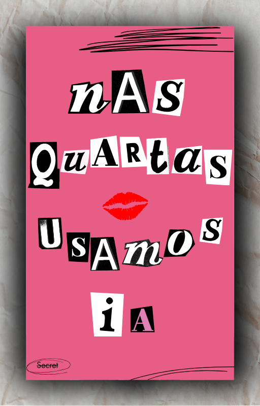

-------

# Nas Quartas Usamos IA

Projeto com o objetivo de gerar um ebook digital utilizando inteligência artificial de forma divertida.
Ilustra mini histórias das personagens de Mean Girls enfrentando desafios como Gerentes de Projetos e utilizando ferramentas de IA para resolvê-los. 

## 💻 Tecnologias utilizadas no projeto

- [ChatGPT](https://chat.openai.com/) 
- [MidJourney](https://www.midjourney.com/app/)
- [Canva](https://www.canva.com/)

## 🧠 Prompts

ChatGPT：

|   Ação   | prompt                                                                                                                                                                                                                                                                         |
| :------: | ------------------------------------------------------------------------------------------------------------------------------------------------------------------------------------------------------------------------------------------------------------------------------ |
|  título  | Crie o título de um ebook focado no público feminino de tecnologia, com temática informal misturando o tema do filme Mean Girls com inteligência artificial. Quero 4 sugestões de títulos criativos                                                      |
| conteúdo | Crie um texto para o ebook selecionando situações problemáticas que Gerentes de Projetos vivenciem, relacionando com as principais personagens do Mean Girls e com 2 ferramentas de IA que sejam a solução de forma criativa. O texto deve objetivo e conter: O nome das personagens, a situação, as ferramentas e uma frase icônica do filme que combine com cada história |

Midjourney：

|  Ação  | prompt                                                                                 |
| :----: | -------------------------------------------------------------------------------------- |
| capa | Create a cover reminiscent of the Mean Girls Burn Book, with magazine cutout letters spelling 'Nas Quartas Usamos IA' in a disorganized way. Include scribbles, words like 'secret', a crumpled paper background effect, and shadowing|

## ✨ Features

- Conteúdo gerado via ChatGPT
- Imagens geradas via MidJourney e Canva IA

## 📚 Materiais

- Capa criada em `assets`
- ebook gerado em `output`

